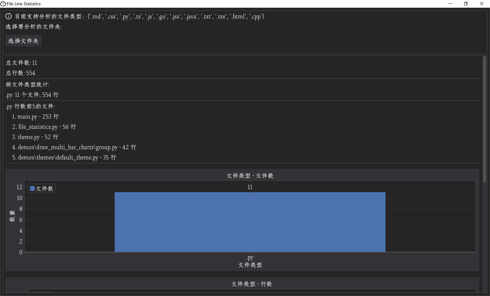
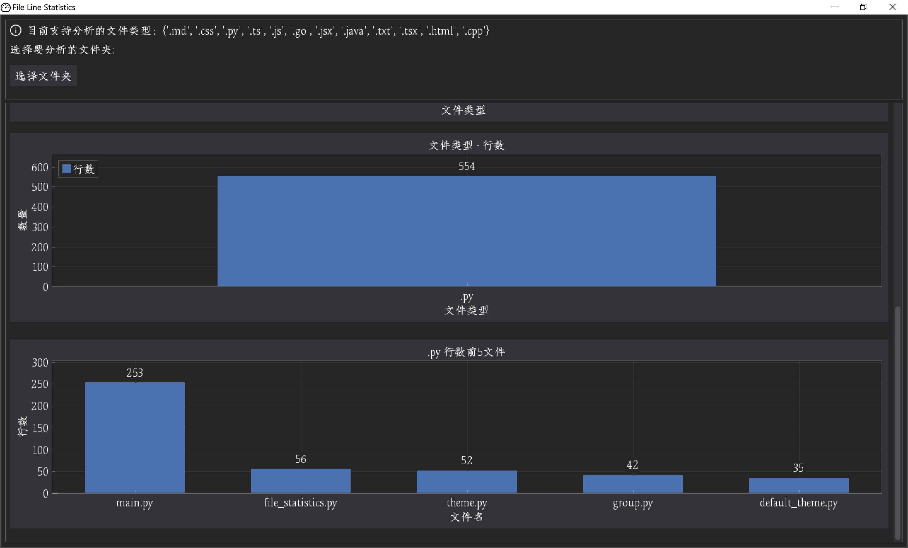
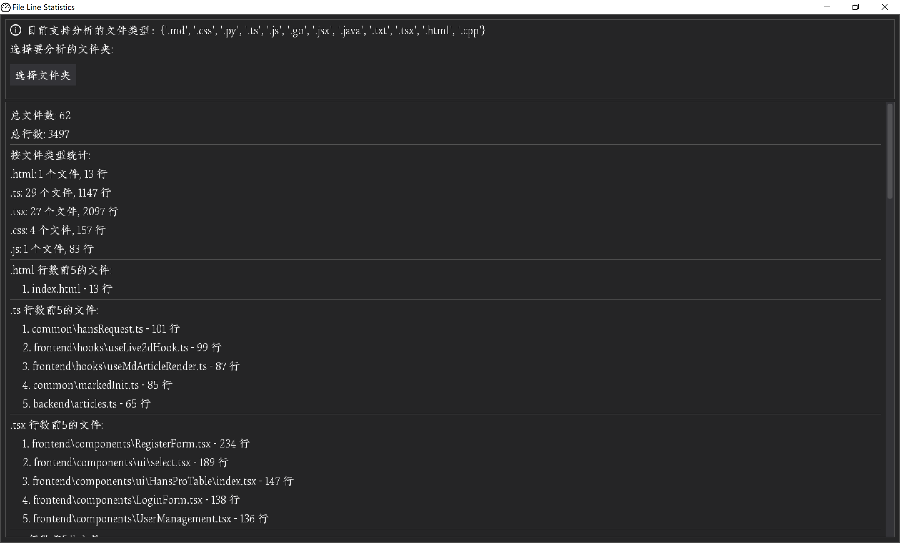
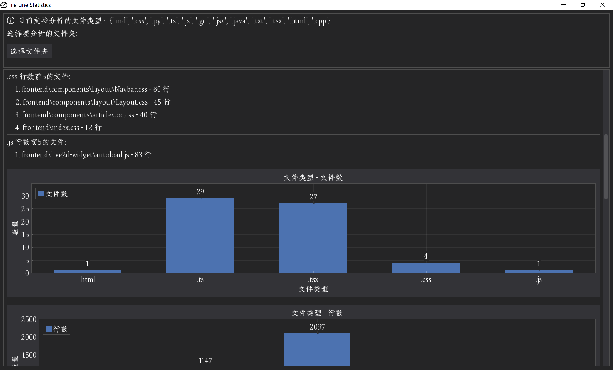
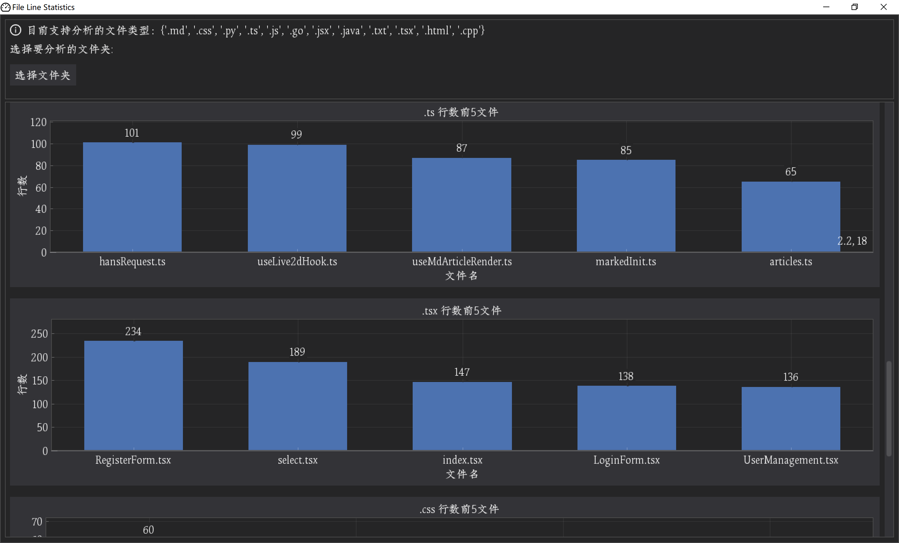

[TOC]

# uv初体验：用Dear PyGui写一个Python代码行数统计应用

## 引言

看了这个视频，想试试。

## 运行效果

只有Python文件的文件夹：






真实前端项目：









## 安装uv、初始化项目

执行命令：

```powershell
powershell -ExecutionPolicy ByPass -c "irm https://astral.sh/uv/install.ps1 | iex"
```

输出：

```
Downloading uv 0.7.12 (x86_64-pc-windows-msvc)
Installing to ~\.local\bin
  uv.exe
  uvx.exe
  uvw.exe
everything's installed!

To add ~\.local\bin to your PATH, either restart your shell or run:

    set Path=~\.local\bin;%Path%   (cmd)
    $env:Path = "~\.local\bin;$env:Path"   (powershell)
```

输入`uv --version`可检查uv是否安装成功。

输入`uv init code-line-statistics`，没有任何交互，即可创建一个模板项目。为了指定这个项目使用Python 3.10，执行：`uv python pin 3.10`。

我们Dear PyGui来实现GUI程序，装一下：`uv add dearpygui`

然后准备一段Dear PyGui Hello World代码：

```python
import dearpygui.dearpygui as dpg


def main():
    dpg.create_context()
    dpg.create_viewport(title='Custom Title', width=600, height=300)

    with dpg.window(label="Example Window"):
        dpg.add_text("Hello, world")
        dpg.add_button(label="Save")
        dpg.add_input_text(label="string", default_value="Quick brown fox")
        dpg.add_slider_float(label="float", default_value=0.273, max_value=1)

    dpg.setup_dearpygui()
    dpg.show_viewport()
    dpg.start_dearpygui()
    dpg.destroy_context()


if __name__ == "__main__":
    main()
```

运行：`uv run main.py`

### exe图标制作

在antd官网找了个dashboard的svg（`icons\dashboard.svg`），然后在 https://www.aconvert.com/cn/icon/svg-to-ico/ 把svg转为ico。可以，这很前端。

## 常规：解决字体问题

在网上随便找了一个中文字体：[传送门](https://www.fonts.net.cn/fonts-zh/tag-songti-1.html)。然后改代码：

```python
chinese_font_path = os.path.join('fonts', 'ShanHaiJiGuJiangNanSongKeW-2.ttf')

def add_font_for_dpg():
    with dpg.font_registry():
        with dpg.font(chinese_font_path, 18) as font1:
            dpg.add_font_range_hint(dpg.mvFontRangeHint_Default)
            dpg.add_font_range_hint(dpg.mvFontRangeHint_Chinese_Simplified_Common)
            dpg.add_font_range_hint(dpg.mvFontRangeHint_Chinese_Full)
            dpg.bind_font(font1)
```

在`dpg.create_context()`之后调用即可。

## 无解：窗口标题的中文是乱码

但是，解决了字体问题后，我们发现，窗口标题的中文仍然是乱码。查了搜索引擎，问了LLM，查了GitHub，都没找到解决方案。索性翻源码。于是我找到了[src/mvViewport_win32.cpp](https://github.com/hoffstadt/DearPyGui/blob/master/src/mvViewport_win32.cpp)：

```cpp
    viewportData->handle = CreateWindow(viewportData->wc.lpszClassName, _T(viewport.title.c_str()),
		viewportData->modes,
		viewport.xpos, viewport.ypos,
		viewport.actualWidth, viewport.actualHeight,
		nullptr, nullptr, viewportData->wc.hInstance, nullptr);

         if (viewport.titleDirty)
		{
			SetWindowTextA(viewportData->handle, viewport.title.c_str());
			viewport.titleDirty = false;
		}
```

这里涉及到`SetWindowTextA`、`CreateWindow`这两个Windows API，不知道为什么要选用这两个不支持中文的API。但我还是死马当活马医，问了下deepseek：

>大佬，你是一名专家C++程序员，精通C++、Python等语言。我在dearpygui的源码里找到如下代码：
>viewportData->handle = CreateWindow(viewportData->wc.lpszClassName, _T(viewport.title.c_str()),
>viewportData->modes,
>viewport.xpos, viewport.ypos,
>viewport.actualWidth, viewport.actualHeight,
>nullptr, nullptr, viewportData->wc.hInstance, nullptr);
>if (viewport.titleDirty)
>{
>SetWindowTextA(viewportData->handle, viewport.title.c_str());
>viewport.titleDirty = false;
>}
>这里的viewport.title是从dearpygui的Python层传入的。在dearpygui中传入窗口标题的代码如下：dpg.create_viewport(title='文件统计工具', width=800, height=600, small_icon=SMALL_ICON_PATH, large_icon=LARGE_ICON_PATH)
>现在发现由于源码的限制，传入中文的title只能得到窗口标题的乱码。请问能否仅修改Python层的源码，让dearpygui的窗口能够正常显示中文标题

得到的代码如下：

```python
def create_viewport(title='', width=800, height=600, small_icon='', large_icon=''):
    # 确保标题是字符串类型
    if not isinstance(title, str):
        title = str(title)
    
    # 将Unicode字符串编码为ANSI编码（Windows-1252或GBK）
    try:
        # 尝试使用GBK编码（支持中文）
        encoded_title = title.encode('gbk')
    except UnicodeEncodeError:
        # 如果GBK编码失败，回退到Windows默认ANSI编码
        encoded_title = title.encode('cp1252', errors='ignore')
    
    # 这里需要调用原始的函数，但传递编码后的标题
    # 具体实现取决于dearpygui的内部结构
    _original_create_viewport(title=encoded_title, width=width, height=height, 
                             small_icon=small_icon, large_icon=large_icon)
```

亲测无用。那就算了，不用中文标题了，还是用英文吧。

## 常规：接入pytest实现单测

pytest是大多数项目都会用到的，不需要每个项目的虚拟环境都装一遍，可以用`uv tool install pytest`全局安装。

为了让单测包成功导入被测文件，需要修改一下项目结构，把python文件放进src文件夹，`__init__.py`可建可不建。然后`pyproject.toml`新增：

```ini
[tool.pytest.ini_options]
pythonpath = "src"
```

相应地，运行GUI程序的命令也变为`uv run src/main.py`。

最后正常执行`pytest --html=coverage/report.html`即可。

## 常规：用表格展示数据

```python
    def display_by_file_type():
        if not statistics['by_extension']:
            dpg.add_text('啥都木有~', parent=RESULTS_WINDOW_TAG)
            return
        with dpg.table(parent=RESULTS_WINDOW_TAG, header_row=True, resizable=True, policy=dpg.mvTable_SizingStretchProp, borders_outerH=True, borders_innerV=True, borders_innerH=True, borders_outerV=True):
            dpg.add_table_column(label='后缀名')
            dpg.add_table_column(label='文件数')
            dpg.add_table_column(label='行数')
            for ext, data in statistics['by_extension'].items():
                with dpg.table_row():
                    with dpg.table_cell():
                        dpg.add_text(ext)
                    with dpg.table_cell():
                        dpg.add_text(data['count'])
                    with dpg.table_cell():
                        dpg.add_text(data['lines'])
```

借鉴了[官方文档](https://dearpygui.readthedocs.io/en/latest/documentation/tables.html)的代码

## 难点：打包为exe

注意：`pyinstaller`理论上可以像pytest一样，用`uv tool install pyinstaller`装，但这样做根本跑不通。只有在虚拟环境中安装才能跑通全流程。

首先`uv add pyinstaller`，接着激活虚拟环境：

- 如果你使用VSCode，打开项目，等几分钟，虚拟环境就会自己激活。
- 如果直接使用命令行，可以执行`.venv\Scripts\activate`。

激活虚拟环境后，在项目根目录执行`pyinstaller -v`看到的版本号就会跟全局安装的pyinstaller不一样。然后执行一次`pyinstaller -D src/main.py`。这个步骤会完成整个打包动作，但我想要的是这个命令输出的初始的`main.spec`，之后要修改它。

我希望给项目提供`main.spec`和`main-onefile.spec`，打包命令分别如下：

```powershell
pyinstaller main.spec
pyinstaller main-onefile.spec --distpath=dist-onefile --workpath=build-onefile
```

顾名思义，onefile版本的exe，可以单独运行，但`main.spec`打包出的exe需要依赖一整个`_internal`文件夹才能正常运行。

`main.spec`如下：

```python
# -*- mode: python ; coding: utf-8 -*-

block_cipher = None

# 添加资源文件到datas列表
added_files = [
    ('fonts/ShanHaiJiGuJiangNanSongKeW-2.ttf', 'fonts'),
    ('icons/dashboard-32.ico', 'icons'),
    ('icons/dashboard-256.ico', 'icons'),
    ('icons/info-circle-32.png', 'icons'),
]

a = Analysis(['src\\main.py'],
             pathex=['src'],
             binaries=[],
             datas=added_files,
             hiddenimports=[],
             hookspath=[],
             hooksconfig={},
             runtime_hooks=[],
             excludes=[],
             win_no_prefer_redirects=False,
             win_private_assemblies=False,
             cipher=block_cipher,
             noarchive=False)
pyz = PYZ(a.pure, a.zipped_data,
          cipher=block_cipher)

exe = EXE(pyz,
          a.scripts, 
          [],
          exclude_binaries=True,
          name='code-line-statistics',
          debug=False,
          bootloader_ignore_signals=False,
          strip=False,
          upx=True,
          console=False,
          disable_windowed_traceback=False,
          target_arch=None,
          codesign_identity=None,
          entitlements_file=None,
          icon='icons/dashboard-32.ico')
coll = COLLECT(exe,
               a.binaries,
               a.zipfiles,
               a.datas, 
               strip=False,
               upx=True,
               upx_exclude=[],
               name='main')
```

踩坑点：

`main-onefile.spec`我是让deepseek生成的，它和`main.spec`的区别主要是少了COLLECT步骤，除此以外基本无区别。